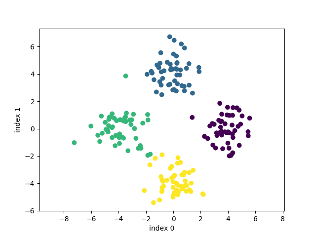
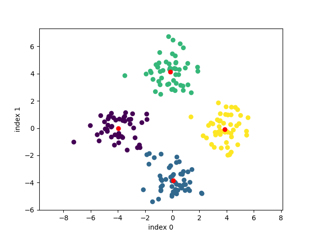
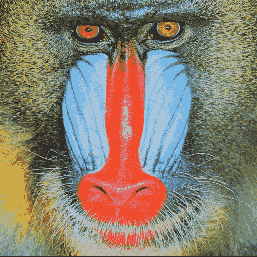
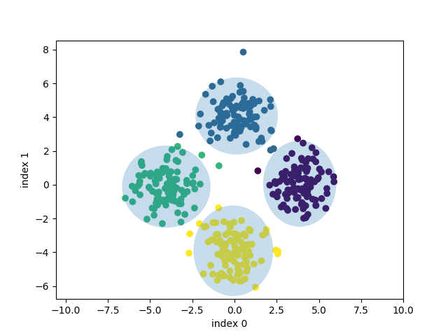
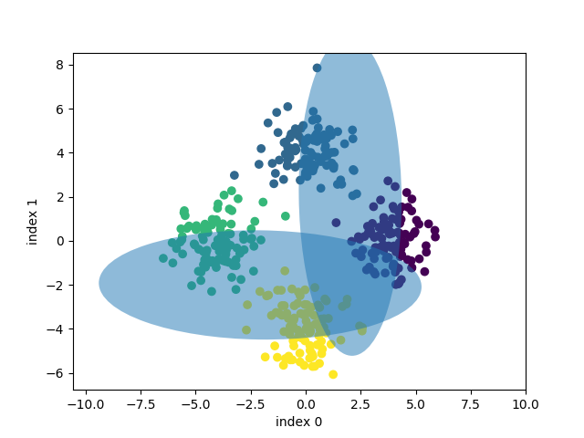

Problem 1
------------

* Real labels



* Predicted labels



* Baboon after compression



* GMMs

Random sampling to initialize does not seem to work, rank of many covariance matrices << their size, (48 vs 64 etc), and gets stuck adding the identity matrix * 0.001.

Initializing with k-means seems to work, but it is a much better start than random. I have verified the initial mean and covariance matrices for random sampling, they seem possible.

```
Random Sampling:
MEANS =  [[ 0.37454012  0.95071431]
 [ 0.73199394  0.59865848]
 [ 0.15601864  0.15599452]
 [ 0.05808361  0.86617615]]
COV =  [[ 1.  0.]
 [ 0.  1.]]
PRIOR =  0.25
COV =  [[ 1.  0.]
 [ 0.  1.]]
PRIOR =  0.25
COV =  [[ 1.  0.]
 [ 0.  1.]]
PRIOR =  0.25
COV =  [[ 1.  0.]
 [ 0.  1.]]
PRIOR =  0.25
```

I have tried double checking equations but can't find the bug. (I am using the VM)



* GMMs random sampling

